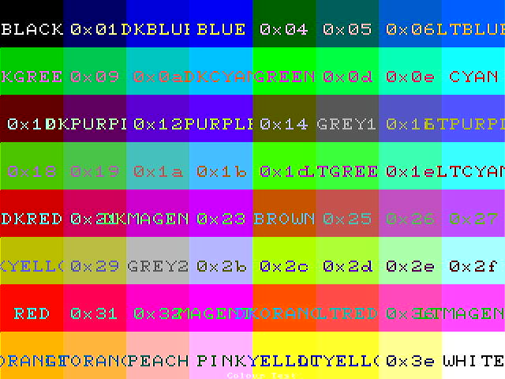
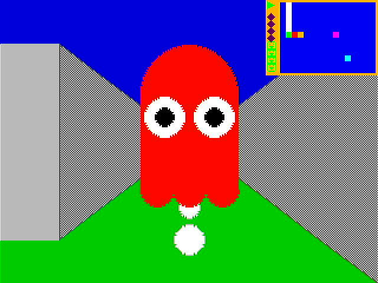
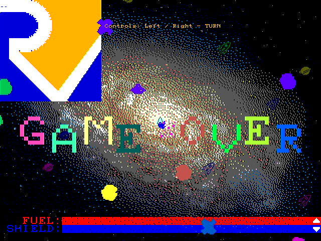
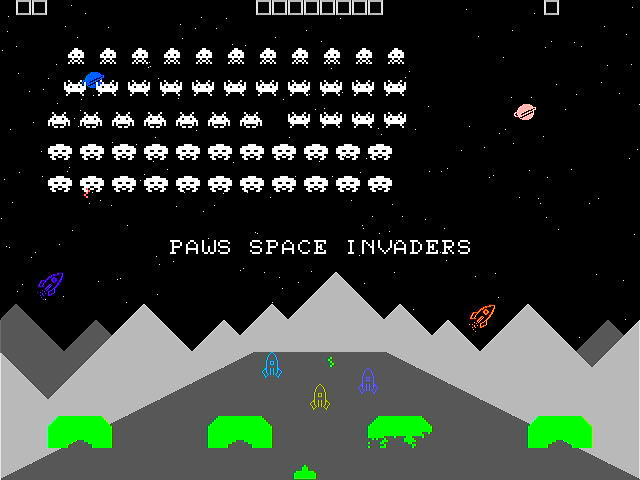
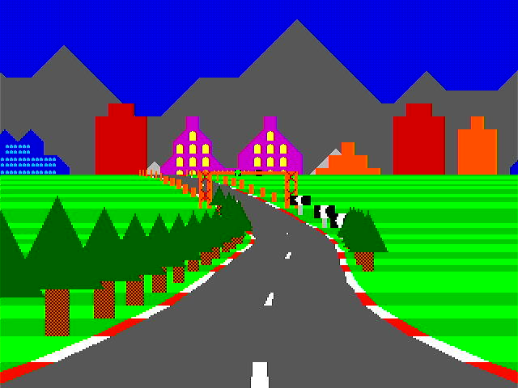

# PAWS a Risc-V RVIMAFC CPU (RETIRED)

* Written in Silice
    * Inspired by ICE-V by [ICE-V](https://github.com/sylefeb/Silice/tree/master/projects/ice-v) by @sylefeb

# PLEASE USE THE PAWSv2 REPOSITORY AT [PAWSv2](https://github.com/rob-ng15/PAWSv2)

 64 Colour Display

 Demonstration game for the GPU and the hardware accelerated drawing of 2D Shapes

 Demonstration game for the sprites

 Demonstration game for the blitter and sprites

 Test for the floating point unit and the GPU

